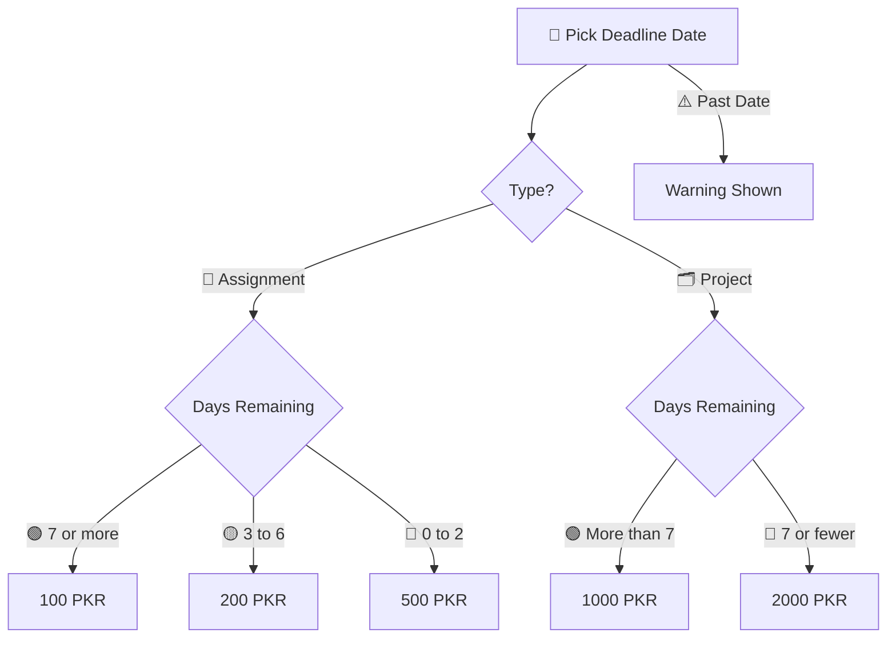

<div align="center">


<br/>


<br/>

🔗 **Live Demo:** [static-webpage-6mnb563dj-aah18751.vercel.app](https://static-webpage-6mnb563dj-aah18751.vercel.app/)

<a href="https://static-webpage-6mnb563dj-aah18751.vercel.app/">

</a>

</div>

<br/>

> 📘 Modern Next.js application offering academic assignment and web development project services with an instant price calculator and direct Gmail & WhatsApp contact options.

---

## 📖 About The Project

This application is built for the **Codoc IT Internship Development Programme, Assignment 2**, upgraded to modern frontend engineering standards using **Next.js 15 App Router**, **React 19**, **TypeScript**, and **Tailwind CSS v4**.

It serves as a student service portal where users can:
- 💰 Calculate exact pricing for assignments and projects based on deadline urgency
- 📩 Send direct inquiries via pre-filled Gmail messages
- 📱 Connect instantly via WhatsApp with one-click pre-filled inquiry buttons
- 🎨 Enjoy a high-end glassmorphic dark theme UI with smooth micro-interactions and animations

---

## ✨ Key Features

| Feature | Description |
|---------|-------------|
| ⚡ **Next.js 15 & React 19** | Modern App Router architecture with full SSR and performance optimization |
| 🛡️ **TypeScript Safety** | Strictly typed component architecture and calculation models |
| 🎨 **Tailwind CSS v4 & Glassmorphism** | Custom dark mode UI design system with vibrant ambient glows and hover effects |
| 💰 **Interactive Price Calculator** | Dynamic pricing engine supporting quick deadline selection (+1, +3, +7 days) and urgency breakdown |
| 📩 **Gmail Form Integration** | Generates pre-filled mailto messages directly to `abdulazeem7982@gmail.com` |
| 📱 **Floating WhatsApp Widget** | One-click instant chat button linking directly to `+92 322 8535002` |
| 📐 **Fully Responsive** | Optimized for mobile, tablet, and desktop viewports |

---

## 💰 Pricing Logic Flowchart



**📝 Assignments**
- 🟢 **7+ Days:** 100 PKR
- 🟡 **3–6 Days:** 200 PKR
- 🔴 **0–2 Days:** 500 PKR

**🗂️ Projects**
- 🟢 **More than 7 Days:** 1000 PKR
- 🔴 **7 or fewer Days:** 2000 PKR

---

## 🛠️ Built With

<div align="center">


&nbsp;

&nbsp;

&nbsp;

&nbsp;


</div>

---

## 📂 Project Structure

```
static-webpage/
├── 📁 src/
│   ├── 📁 app/
│   │   ├── 📄 globals.css       # Custom Tailwind CSS imports, variables & glassmorphism utilities
│   │   ├── 📄 layout.tsx        # SEO metadata, Google Fonts & root layout
│   │   └── 📄 page.tsx          # Main landing page component
│   └── 📁 components/
│       ├── 📄 Header.tsx            # Sticky glassmorphic header & navigation drawer
│       ├── 📄 Hero.tsx              # Hero section with animated typography & badges
│       ├── 📄 Services.tsx          # Interactive services cards
│       ├── 📄 PricingCalculator.tsx # Interactive TypeScript pricing calculator
│       ├── 📄 WhyChooseMe.tsx       # Benefits grid & interactive FAQ accordion
│       ├── 📄 ContactSection.tsx    # Contact form & Gmail mailto generator
│       ├── 📄 WhatsAppWidget.tsx    # Floating WhatsApp chat widget
│       └── 📄 Footer.tsx            # Modern footer with credits
├── 📄 next.config.ts            # Next.js configuration
├── 📄 postcss.config.mjs        # PostCSS setup for Tailwind CSS v4
├── 📄 tsconfig.json             # TypeScript compiler settings
├── 📄 package.json              # Project dependencies & scripts
└── 📘 README.md                # Project documentation
```

---

## 💻 Getting Started Locally

To run this Next.js project on your local machine:

```bash
# 1. Clone the repository
git clone https://github.com/AbdulAzeemHashmi/static-webpage.git

# 2. Navigate into the folder
cd static-webpage

# 3. Install dependencies
npm install

# 4. Start the development server
npm run dev
```

Open [http://localhost:3000](http://localhost:3000) in your browser to view the application.

---

## 🚀 Building for Production

To test the production build locally:

```bash
# Build production bundle
npm run build

# Start production server
npm run start
```

---

## 👨‍💻 Author

<table>
<tr>
<td>🧑‍💻 <b>Name</b></td>
<td>Abdul Azeem</td>
</tr>
<tr>
<td>🐙 <b>GitHub</b></td>
<td><a href="https://github.com/AbdulAzeemHashmi">@AbdulAzeemHashmi</a></td>
</tr>
<tr>
<td>✉️ <b>Email</b></td>
<td>abdulazeem7982@gmail.com</td>
</tr>
<tr>
<td>📱 <b>WhatsApp</b></td>
<td>+92 322 8535002</td>
</tr>
</table>

<br/>

Made with 🧡 by Abdul Azeem for the Codoc IT Internship Development Programme.
