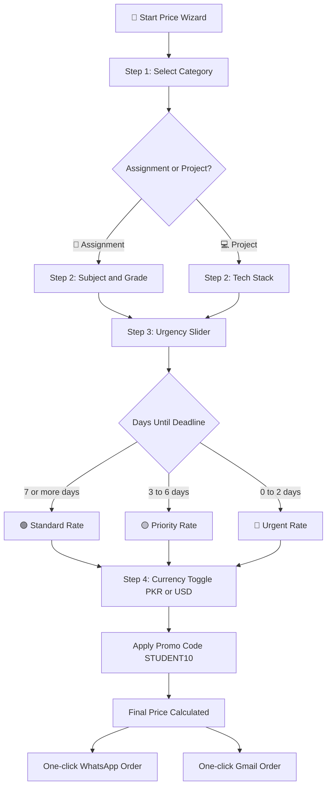

<div align="center">

<!-- Animated wave banner -->


<br/>

<!-- Tech stack badges -->


<br/>

<!-- Social stats -->

&nbsp;

&nbsp;

&nbsp;


<br/><br/>

<!-- Animated typing text -->


<br/><br/>

<!-- Live site CTA -->
<a href="https://assignment-2-static-webpage-silk.vercel.app/" target="_blank">
  
</a>
&nbsp;
<a href="https://github.com/AbdulAzeemHashmi/static-webpage" target="_blank">
  
</a>

<br/><br/>

</div>

---

<div align="center">

## 🌟 What Is This Project?

</div>

> 🎓 A premium, fully interactive **student assignment and software project services portal** built for the **Codoc IT Internship Programme (Assignment 2)**. Features a glassmorphic dark UI with a real-time price wizard, deliverable inspector, portfolio gallery, and direct WhatsApp plus Gmail contact integration.

---

## 📸 Live Preview

<div align="center">

| Section | Description |
|---|---|
| 🏠 **Hero Section** | Animated headline, badge row, dual CTA buttons, 3D visual card |
| 🛠 **Services** | Three interactive glass cards with colored top accent bars |
| 💰 **Price Wizard** | 4-step interactive calculator with PKR / USD toggle and urgency slider |
| 🔍 **Quality Inspector** | Code viewer, paper preview with 0% Turnitin badge, SQL schema |
| 📁 **Portfolio Gallery** | Filterable past projects (Web Apps, Python, Academic, Databases) |
| ⭐ **Student Reviews** | Verified reviews with avatar initials, star ratings, and milestone stats |
| ❓ **FAQ Section** | Smooth animated accordion with reasons to choose this service |
| 📩 **Contact Form** | Pre-filled Gmail launcher with WhatsApp direct button |

</div>

---

## ✨ Features at a Glance

<div align="center">

```
┌─────────────────────────────────────────────────────────────────────┐
│                    CORE FEATURE HIGHLIGHTS                         │
├────────────────────────┬────────────────────────────────────────────┤
│  ⚡ Next.js 15          │  App Router with Static Export             │
│  ⚛️  React 19           │  Server and Client Components               │
│  🛡️  TypeScript 5       │  Strict typing throughout                  │
│  🎨 Tailwind CSS v4    │  Custom dark glassmorphism design           │
│  💰 4-Step Wizard      │  Dynamic PKR / USD pricing engine          │
│  📩 Gmail Integration  │  Pre-filled mailto contact form            │
│  📱 WhatsApp Widget    │  Floating pulsing chat button              │
│  🔍 Quality Inspector  │  Code, paper, and SQL preview panels       │
│  📁 Portfolio Gallery  │  Filterable past work showcase             │
│  ⭐ Verified Reviews   │  Student testimonials with avatar circles  │
│  🔥 Smooth Animations  │  Micro-interactions on every interaction   │
│  📐 Fully Responsive   │  Mobile, tablet, and desktop optimized     │
└────────────────────────┴────────────────────────────────────────────┘
```

</div>

---

## 🛠️ Tech Stack

<div align="center">


</div>

<br/>

| Technology | Version | Purpose |
|---|---|---|
| ⚫ **Next.js** | 15.x | App Router, SSR, Static Export |
| ⚛️ **React** | 19.x | UI Component Library |
| 🔷 **TypeScript** | 5.x | Type Safety and DX |
| 🌊 **Tailwind CSS** | v4 | Utility-First Styling |
| 🔺 **Vercel** | Latest | Production Deployment |
| ✨ **Lucide React** | Latest | Icon Library |

---

## 💰 Pricing Logic



### 📊 Rate Table

| Work Type | Timeline | Rate (PKR) | Rate (USD) |
|---|---|---|---|
| 📝 Assignment | 7 or more days | 100 PKR | ~0.35 USD |
| 📝 Assignment | 3 to 6 days | 200 PKR | ~0.71 USD |
| 📝 Assignment | 0 to 2 days (Urgent) | 500 PKR | ~1.78 USD |
| 💻 Project | More than 7 days | 1,000 PKR | ~3.57 USD |
| 💻 Project | 7 days or fewer | 2,000 PKR | ~7.14 USD |

> 🎟️ Use promo code **`STUDENT10`** for an additional discount!

---

## 📂 Project Structure

```
📦 static-webpage/
├── 📁 public/
│   └── 📁 images/
│       ├── 🖼️  hero_illustration.png     # 3D glassmorphic dashboard graphic
│       ├── 🖼️  portfolio_mockup.png      # Full-stack app showcase mockup
│       └── 🖼️  academic_mockup.png       # IEEE paper preview mockup
│
├── 📁 src/
│   ├── 📁 app/
│   │   ├── 🎨 globals.css               # Tailwind imports, glassmorphism utilities
│   │   ├── 📐 layout.tsx                # SEO metadata, Google Fonts, root layout
│   │   └── 🏠 page.tsx                  # Main landing page assembly
│   │
│   └── 📁 components/
│       ├── 🧭 Header.tsx                # Sticky banner, nav, mobile drawer
│       ├── 🦸 Hero.tsx                  # Headline, CTAs, 3D visual card
│       ├── 🛠️  Services.tsx              # Three service offering cards
│       ├── 🧙 OrderWizard.tsx           # Interactive 4-step price wizard
│       ├── 🔍 DeliverableInspector.tsx  # Code and paper quality preview
│       ├── 📁 PortfolioGallery.tsx      # Filterable past projects gallery
│       ├── ⭐ Testimonials.tsx          # Verified reviews and stats bar
│       ├── ❓ WhyChooseMe.tsx           # Benefits grid and FAQ accordion
│       ├── 📩 ContactSection.tsx        # Gmail form and direct contact cards
│       ├── 💬 WhatsAppWidget.tsx        # Floating WhatsApp action button
│       ├── 🍞 ToastProvider.tsx         # Floating notification alerts
│       └── 🔻 Footer.tsx                # Brand, links, social icons
│
├── ⚙️  next.config.ts                   # Next.js configuration
├── 🔧 postcss.config.mjs               # PostCSS for Tailwind CSS v4
├── 📘 tsconfig.json                     # TypeScript compiler settings
├── 📦 package.json                      # Dependencies and scripts
├── 🔺 vercel.json                       # Vercel deployment config
└── 📖 README.md                         # Project documentation
```

---

## 🚀 Getting Started

### Prerequisites

Make sure you have the following installed on your system:


### 1️⃣ Clone the Repository

```bash
git clone https://github.com/AbdulAzeemHashmi/static-webpage.git
cd static-webpage
```

### 2️⃣ Install Dependencies

```bash
npm install
```

### 3️⃣ Run Development Server

```bash
npm run dev
```

Open [http://localhost:3000](http://localhost:3000) in your browser.

### 4️⃣ Build for Production

```bash
npm run build
npm run start
```

### 5️⃣ Deploy to Vercel

```bash
npx vercel --prod
```

---

## 🌐 Deployment

This project is deployed on **Vercel** with automatic static optimization.

| Environment | URL |
|---|---|
| 🟢 **Production** | [assignment-2-static-webpage-silk.vercel.app](https://assignment-2-static-webpage-silk.vercel.app/) |
| 📦 **Repository** | [github.com/AbdulAzeemHashmi/static-webpage](https://github.com/AbdulAzeemHashmi/static-webpage) |
| 📋 **Vercel Dashboard** | [vercel.com/aah18751/static-webpage](https://vercel.com/aah18751/static-webpage) |

---

## 🎨 Design System

```
Color Palette
┌──────────────────────────────────────────────────────────┐
│  Background  #090d16  ████  Deep Navy Dark               │
│  Cyan        #38bdf8  ████  Primary Accent               │
│  Purple      #a855f7  ████  Secondary Accent             │
│  Pink        #ec4899  ████  Tertiary Accent              │
│  Emerald     #10b981  ████  Success / WhatsApp           │
│  Slate       #1e293b  ████  Card Borders                 │
└──────────────────────────────────────────────────────────┘

Typography
  Headings  ->  Outfit (Black 900, ExtraBold 800)
  Body      ->  Inter  (Regular 400, Medium 500, SemiBold 600)

Effects
  Glass Cards  ->  rgba(15, 23, 42, 0.70) + backdrop-filter: blur(18px)
  Gradients    ->  cyan 0% -> purple 55% -> pink 100%
  Glow Orbs    ->  radial blurs, opacity 0.20, filter blur(110px)
```

---

## 📈 Performance

<div align="center">

| Metric | Score |
|---|---|
| ⚡ First Load JS | 127 kB |
| 🏗️ Build Type | Static Export (SSG) |
| 📄 Page Size | 24.2 kB (gzipped) |
| 🔧 Compiler | Turbopack (4.0s build) |
| 🌍 CDN | Vercel Edge Network |

</div>

---

## 🔧 Available Scripts

```bash
npm run dev       # Start Next.js dev server with Turbopack
npm run build     # Build optimized production bundle
npm run start     # Start production server locally
npm run lint      # Run ESLint checks
```

---

## 📬 Contact

<div align="center">

<table>
<tr>
<td align="center">👤 <b>Name</b></td>
<td>Abdul Azeem</td>
</tr>
<tr>
<td align="center">🐙 <b>GitHub</b></td>
<td><a href="https://github.com/AbdulAzeemHashmi">@AbdulAzeemHashmi</a></td>
</tr>
<tr>
<td align="center">✉️ <b>Email</b></td>
<td><a href="mailto:abdulazeem7982@gmail.com">abdulazeem7982@gmail.com</a></td>
</tr>
<tr>
<td align="center">💬 <b>WhatsApp</b></td>
<td><a href="https://wa.me/923228535002">+92 322 8535002</a></td>
</tr>
<tr>
<td align="center">🌐 <b>Live Site</b></td>
<td><a href="https://assignment-2-static-webpage-silk.vercel.app/">assignment-2-static-webpage-silk.vercel.app</a></td>
</tr>
</table>

<br/>

[](https://wa.me/923228535002)
&nbsp;
[](mailto:abdulazeem7982@gmail.com)
&nbsp;
[](https://github.com/AbdulAzeemHashmi)

</div>

---

## 📜 License

This project was created as **Assignment 2** for the **Codoc IT Internship Development Programme**.

---

<div align="center">


<br/>

**Made with ❤️ and Next.js by Abdul Azeem**

*Codoc IT Internship Programme, Assignment 2*


</div>
